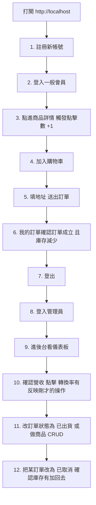

# 吉依卡哇專賣店 — 開發者指南

本文件用繁體中文編寫，目標只有一個：**讓你知道要改什麼東西、就去動哪個檔案。**

- 想改**顏色**？→ [§3.1 樣式檔分工](#31-樣式檔分工只有四個檔案)
- 想改**字體或文字動畫**？→ [§3.2](#32-字體與文字動畫)
- 想改**某一頁的畫面**？→ [§4 頁面對照表](#4-頁面對照表改哪裡渲染哪裡)
- 想改**到處都有的小元件**（按鈕、徽章、載入中）？→ [§3.3 共用元件](#33-共用元件)
- 想**新增一個功能**？→ [§6 擴充實戰](#6-擴充功能實戰以優惠券為例)

---

## 1. 專案總覽

由 Docker Compose 編排三個服務：

| 服務 | 技術 | 位置 | 對外埠 |
| :--- | :--- | :--- | :--- |
| `frontend` | Angular 18（Standalone，無 NgModule）+ Nginx | `/frontend` | `80` |
| `backend` | Spring Boot 3.x / Java 17 REST API | `/backend` | `8080` |
| `db` | MySQL 8.0 | `/mysql-init` 提供初始化 SQL | `3306` |

啟動：

```bash
docker compose up -d --build
# 打開 http://localhost
```

> 改了 Java 或前端程式碼後要重新 build 才看得到效果：
> `docker compose up -d --build backend frontend`

### 預設測試帳號

| 類別 | 帳號 | 密碼 | 角色 | 權限 |
| :--- | :--- | :--- | :--- | :--- |
| 一般會員 | `user@example.com` | `password123` | `ROLE_USER` | 前台瀏覽、購物車、結帳、看自己的訂單 |
| 系統管理員 | `admin@example.com` | `admin123` | `ROLE_ADMIN` | 全部前台功能 ＋ 後台看板／商品／訂單管理 |

---

## 2. 後端結構

採分層架構，`service` 介面與 `impl` 實作分離。

```
backend/src/main/java/com/ecommerce/
├── config/SecurityConfig.java   # 權限過濾鏈：哪個 API 要登入、哪個限管理員
├── security/                    # JWT 產生與驗證、UserDetails、請求過濾器
├── entity/                      # JPA 實體，對應 MySQL 資料表
├── repository/                  # Spring Data JPA，負責查詢
├── dto/                         # 傳給前端的資料形狀（不直接暴露 Entity）
├── exception/                   # GlobalExceptionHandler：統一錯誤格式
├── service/  + service/impl/    # 業務邏輯
└── controller/                  # REST API 路由
```

### 常改的幾個點

| 想做的事 | 改哪裡 |
| :--- | :--- |
| 開放／限制某支 API 的權限 | [SecurityConfig.java](./backend/src/main/java/com/ecommerce/config/SecurityConfig.java) 的 `authorizeHttpRequests` |
| 結帳流程、扣庫存邏輯 | [OrderServiceImpl.java](./backend/src/main/java/com/ecommerce/service/impl/OrderServiceImpl.java) `checkout()` |
| 訂單狀態轉換規則 | 同上，`updateOrderStatus()` |
| 儀表板的後端統計 | [AnalyticsServiceImpl.java](./backend/src/main/java/com/ecommerce/service/impl/AnalyticsServiceImpl.java) |
| 錯誤回傳格式 | [GlobalExceptionHandler.java](./backend/src/main/java/com/ecommerce/exception/GlobalExceptionHandler.java) |
| JWT 金鑰、資料庫連線 | [application.yml](./backend/src/main/resources/application.yml) |

### 安全性設計筆記

- **訂單只有本人或管理員讀得到**。判斷寫在 `OrderServiceImpl.getOrderById()`，因為只有 Service 層拿得到訂單的 `user id`。Controller 只負責算出 `isAdmin` 傳進去。
- **結帳扣庫存有加寫入鎖**（`ProductRepository.findByIdForUpdate()`，即 `SELECT ... FOR UPDATE`）。沒有這個鎖，兩張訂單同時結帳會雙雙通過庫存檢查而超賣。
- **訂單改成「已取消」時會把庫存加回去**，否則取消的訂單會讓庫存永久蒸發。
- **JWT 金鑰有預設值但可被環境變數覆寫**：`JWT_SECRET`、`DB_USERNAME`、`DB_PASSWORD`。預設值只給本機開發用，**正式環境務必覆寫**。

---

## 3. 前端結構

```
frontend/src/
├── index.html               # 只放字體 <link> 與 <app-root>
├── styles.css               # 全域樣式的「目錄」，只有 4 行 @import
├── styles/                  # ← 全域樣式實體（見 §3.1）
│   ├── tokens.css
│   ├── typography.css
│   ├── base.css
│   └── components.css
└── app/
    ├── core/                # 全域單例
    │   ├── models/          # TS 介面，與後端 DTO 對齊
    │   ├── services/        # AuthService / CartService / OrderService / ProductService / AnalyticsService
    │   ├── interceptors/    # JwtInterceptor：自動帶上 Bearer Token
    │   └── guards/          # AuthGuard（要登入）、AdminGuard（要管理員）
    ├── shared/              # ← 跨頁共用的小元件（見 §3.3）
    ├── layouts/             # 三種版面外框（見 §5）
    ├── features/            # 各功能頁面（見 §4）
    ├── app.routes.ts        # 路由 + Layout 巢狀結構 + Guard
    └── app.config.ts        # 注入 HttpClient、Router、Interceptor
```

### 3.1 樣式檔分工（只有四個檔案）

`src/styles.css` 本身**不寫任何規則**，只決定載入順序。實體都在 `src/styles/`：

| 檔案 | 負責什麼 | 什麼時候改它 |
| :--- | :--- | :--- |
| [tokens.css](./frontend/src/styles/tokens.css) | 所有顏色、圓角、陰影變數 | **想換配色** |
| [typography.css](./frontend/src/styles/typography.css) | 字體、字級、字重、**文字動畫** | **想改字或動畫** |
| [base.css](./frontend/src/styles/base.css) | 重置、**草原背景**、`input`/`button` 預設外觀 | 想改背景或表單元件長相 |
| [components.css](./frontend/src/styles/components.css) | `.card` `.btn-*` `.status-badge` `.data-table` 等共用 class | 想改按鈕／徽章／表格的通用樣式 |

> 順序有意義：`tokens` 先定義變數，後面的檔案才取得到值。

#### 配色規則（很重要，別再踩）

這個專案之前出過「淺色底配白字看不見」的問題，所以立了三條規則，寫在 `tokens.css` 開頭：

1. **文字只用三個墨色**：`--ink`（主文字）、`--ink-soft`（次要）、`--ink-muted`（標籤/軸線）。
2. **白字 `--on-accent` 只准出現在 `--grass-deep` 和 `--berry-deep` 上**。這兩個是唯一通過 4.5:1 對比的深色底。其他彩色（`--sun`、`--grass`）一律配 `--ink`。
3. **淺色 tint（`*-pale`）永遠配深色 ink**，例如 `--ok-pale` 底配 `--ok-ink` 字。

所有配對都用 WCAG 對比公式驗算過，不是憑感覺挑的。**新增顏色時請照著算一次再用。**

#### 草原背景在哪

`base.css` 的 `body::before`。純 CSS，不需要圖檔，由下往上疊：三層草丘 → 雲朵 → 太陽 → 天空漸層，`position: fixed` 讓內容在草原上方捲動。想加減雲朵或改草地顏色就動這裡。

首頁另有一個獨立的草原橫幅，在 [product-list.component.css](./frontend/src/app/features/catalog/product-list/product-list.component.css) 的 `.meadow-hero`。

### 3.2 字體與文字動畫

**字體檔本身由 `index.html` 的 `<link>` 載入**（Fredoka + Quicksand），不是用 CSS `@import` —— `@import` 會擋住後續樣式下載。字型的**套用規則**全部在 `typography.css`。

- `--font-heading`：Fredoka，用於標題與數字，圓潤帶卡通感
- `--font-body`：Quicksand，用於內文

可直接掛在 template 上的**文字動畫 class**（全部定義在 `typography.css`）：

| Class | 效果 | 典型用途 |
| :--- | :--- | :--- |
| `.fade-up` | 淡入並上浮 | 副標、說明文字 |
| `.slide-in` | 從左滑入 | 區塊標題、頁面標題 |
| `.pop-char` | **逐字彈跳**，每個字包一個 span，用 `nth-child` 接力延遲 | 主視覺大標 |
| `.wiggle-hover` | 滑鼠移上去輕輕擺動 | logo、可愛小元素 |
| `.count-pop` | 數值變動時彈一下 | 儀表板 KPI |
| `.stagger` | 掛在**容器**上，子項依序淡入 | 商品格線、卡片列、清單 |

全部是「進場一次」的動畫，不做無限循環。`base.css` 有全域的 `prefers-reduced-motion` 保護，使用者在系統設定關掉動效時這些會自動失效——**新增動畫時不需要自己再寫一次保護**。

`.pop-char` 用法（每個字一個 span，`aria-label` 給輔助科技讀完整句子）：

```html
<h1 aria-label="來草原上挑禮物吧！">
  <span class="pop-char" aria-hidden="true">來</span><span class="pop-char" aria-hidden="true">草</span>…
</h1>
```

### 3.3 共用元件

在 `src/app/shared/`，都是 standalone，直接 `import` 到需要的元件的 `imports` 陣列裡即可。**不要再各頁抄一份。**

| 元件 | 用法 | 取代了什麼 |
| :--- | :--- | :--- |
| [`<app-status-badge>`](./frontend/src/app/shared/status-badge.component.ts) | `[status]="order.status"` 自動帶出中文與配色；或 `tone="bad" label="已售完"` 自訂 | 原本 6 個頁面各自寫的 `switch` + `<span class="status-badge">` |
| [`<app-loading-state>`](./frontend/src/app/shared/loading-state.component.ts) | `text="正在讀取訂單⋯⋯"` | 6 處重複的轉圈 + 文字 |
| [`<app-empty-state>`](./frontend/src/app/shared/empty-state.component.ts) | `text="..."`，`[boxed]="true"` 加卡片外框；可投影圖示（`<svg icon>`）與行動按鈕 | 6 處重複的空畫面 |
| [`<app-page-header>`](./frontend/src/app/shared/page-header.component.ts) | `title="訂單管理" subtitle="..."`，右側動作用內容投影 | 後台 3 個頁面重複的頁首 |

**視覺樣式在 `components.css`，元件只負責挑對 class 與文字**。所以改按鈕圓角要去 `components.css`，改狀態中文要去 `core/models/order.models.ts` 的 `ORDER_STATUS_META`。

### 3.4 幾個共用的常數

| 常數 | 位置 | 用途 |
| :--- | :--- | :--- |
| `ORDER_STATUS_META` | [order.models.ts](./frontend/src/app/core/models/order.models.ts) | 訂單狀態的**中文標籤與樣式 class**，訂單頁／後台／儀表板共用一份 |
| `ORDER_STATUSES` | 同上 | 狀態清單，用來跑篩選頁籤與下拉選單 |
| `PLACEHOLDER_IMAGE` | [product.models.ts](./frontend/src/app/core/models/product.models.ts) | 商品缺圖時的替代圖，內嵌 SVG data URI（不會產生 404） |

---

## 4. 頁面對照表（改哪裡渲染哪裡）

每個頁面都是 `.ts`（邏輯）+ `.html`（結構）+ `.css`（該頁專屬樣式）三件套，路徑同名同目錄。

| 頁面 | 路由 | Layout | 目錄 | 改了會影響 |
| :--- | :--- | :--- | :--- | :--- |
| **首頁商品列表** | `/` | User | [features/catalog/product-list/](./frontend/src/app/features/catalog/product-list/) | 草原橫幅、商品卡片、搜尋框、分類側欄 |
| **商品詳情** | `/products/:id` | User | [features/catalog/product-detail/](./frontend/src/app/features/catalog/product-detail/) | 商品大圖、介紹、數量增減、加入購物車鈕（**進此頁會讓點擊數 +1**） |
| **購物車** | `/cart` | User | [features/cart/cart-view/](./frontend/src/app/features/cart/cart-view/) | 品項列表、數量增減、刪除、金額試算 |
| **結帳** | `/orders/checkout` | User | [features/orders/checkout/](./frontend/src/app/features/orders/checkout/) | 地址輸入、明細覆核、送出訂單 |
| **我的訂單** | `/orders/history` | User | [features/orders/order-history/](./frontend/src/app/features/orders/order-history/) | 歷史訂單卡片、商品快照、狀態徽章 |
| **登入** | `/auth/login` | Auth | [features/auth/login/](./frontend/src/app/features/auth/login/) | 登入表單、錯誤提示 |
| **註冊** | `/auth/register` | Auth | [features/auth/register/](./frontend/src/app/features/auth/register/) | 註冊表單、密碼驗證、成功提示 |
| **後台儀表板** | `/admin/dashboard` | Admin | [features/admin/dashboard/](./frontend/src/app/features/admin/dashboard/) | KPI 卡、營收折線圖、狀態分布、商品成效、庫存警示、最新訂單 |
| **後台商品管理** | `/admin/products` | Admin | [features/admin/product-management/](./frontend/src/app/features/admin/product-management/) | 上架／編輯表單、圖片預覽、商品清單、搜尋 |
| **後台訂單管理** | `/admin/orders` | Admin | [features/admin/order-management/](./frontend/src/app/features/admin/order-management/) | 狀態篩選頁籤、訂單表格、狀態變更下拉 |

路由與 Guard 的對應寫在 [app.routes.ts](./frontend/src/app/app.routes.ts)。

### 儀表板的資料從哪來（重要）

儀表板**沒有專屬的後端聚合 API**。它一次呼叫三支既有的 API，其餘指標全部在前端衍生：

| 來源 API | 用來算什麼 |
| :--- | :--- |
| `GET /api/admin/analytics/stats` | 總營收、訂單數、點擊數、轉換率、商品成效 |
| `GET /api/orders/all` | 營收趨勢（依 `createdAt` 分日彙總）、訂單狀態分布、平均客單價、待處理數、最新訂單 |
| `GET /api/products` | 庫存偏低警示 |

**要加新指標時，先看能不能從這三份資料算出來**，可以的話就在 `dashboard.component.ts` 加一個 `computed()`，不用動後端。

圖表是**手刻 SVG，沒有引入任何圖表函式庫**。折線圖的座標換算在 `dashboard.component.ts` 的 `trend()`，版面常數（`W`/`H`/`padL` 等）在同一個檔案最上方。

圖表的資料色 `--series-1`（藍）與 `--series-2`（橘）**通過色盲分離度驗證**。原本想用「草綠 + 橘」呼應主題，但在紅色盲模擬下兩色差距只有 ΔE 3.2，會糊成一條，已排除。**換圖表顏色前請先驗證，不要憑肉眼判斷。**

---

## 5. 三種版面（Layout）

用巢狀路由達成版面切換。`app.component.html` 只有一個 `<router-outlet>`，是所有 Layout 的根容器。

| Layout | 檔案 | 渲染什麼 |
| :--- | :--- | :--- |
| **User** | [layouts/user-layout/](./frontend/src/app/layouts/user-layout/) | 頂部導覽列（logo、選單、購物車徽章、登入狀態）、Footer、導覽列下緣的一排小草 |
| **Admin** | [layouts/admin-layout/](./frontend/src/app/layouts/admin-layout/) | 左側側邊欄、頂部管理員資訊列 |
| **Auth** | [layouts/auth-layout/](./frontend/src/app/layouts/auth-layout/) | 草原背景 + 置中的手繪外框卡片 |

### 後台側邊欄的收合

側邊欄可以**往左收合成只剩圖示、也可以再拉回來**：

- **切換鈕住在側邊欄自己的頂端**（不是在右側頂部列）。收合後這一欄就只剩它加上選單圖示，版面比較乾淨；箭頭會旋轉 180° 提示可以再拉出來。
- 邏輯在 [admin-layout.component.ts](./frontend/src/app/layouts/admin-layout/admin-layout.component.ts) 的 `toggleSidebar()`。
- 狀態存在 `localStorage`（key: `admin_sidebar_collapsed`），重新整理後會記得使用者的選擇。
- 寬度統一由 CSS 變數 `--sidebar-w` 控制（展開 250px / 收合 68px）。側欄寬度與內容區的左邊距都讀同一個變數，**改寬度只要改這一個值**，不會對不齊。
- 窄螢幕（≤992px）**沒有存過偏好時預設收合**，由 `initialCollapsed()` 判斷。切換鈕在任何寬度都能用，不會出現「按了沒反應」。

---

## 6. 擴充功能實戰（以優惠券為例）

### 後端

1. **資料表**：在 [mysql-init/init.sql](./mysql-init/init.sql) 新增 `coupons` 表。
2. **Entity**：`com.ecommerce.entity.Coupon`，加 `@Entity` 與欄位映射。
3. **Repository**：
   ```java
   public interface CouponRepository extends JpaRepository<Coupon, Long> {
       Optional<Coupon> findByCode(String code);
   }
   ```
4. **DTO**：`com.ecommerce.dto.CouponDTO`。
5. **Service**：`CouponService` 介面 + `impl/CouponServiceImpl`。若要在結帳時套用，改 `OrderServiceImpl.checkout()` 的金額計算並注入 `CouponService`。
6. **Controller**：`CouponController`，暴露 `POST /api/coupons/apply`。
7. **權限**：在 [SecurityConfig.java](./backend/src/main/java/com/ecommerce/config/SecurityConfig.java) 加規則：
   ```java
   .requestMatchers("/api/coupons/apply").authenticated()
   .requestMatchers("/api/admin/coupons/**").hasAuthority("ROLE_ADMIN")
   ```

### 前端

1. `core/models/coupon.models.ts` — TS 介面。
2. `core/services/coupon.service.ts` — 用 `HttpClient` 打後端。
3. 要在結帳頁加輸入框，就改 [checkout 目錄](./frontend/src/app/features/orders/checkout/) 的 `.html` 與 `.ts`。
4. 樣式優先用 `components.css` 既有的 `.card` / `.btn-primary`；真的要新樣式再寫進該頁的 `.css`，**顏色一律用 `tokens.css` 的變數，不要寫死色碼**。

---

## 7. 驗證與測試

### 自動化

```bash
# 後端（在 /backend 下，或用 docker build 驗證編譯）
mvn test

# 前端型別與模板檢查（建置會一併做完整型別檢查）
cd frontend && npx ng build --configuration production
```

後端可用 `@WebMvcTest` / `@SpringBootTest` + `MockMvc`，搭配 `@WithMockUser` 驗證權限（例如一般會員打 `/api/admin/**` 應回 403）。

### 手動主流程



### 改樣式後值得順手檢查的兩件事

1. **對比**：新配色是否仍滿足 4.5:1（一般文字）／3:1（圖表標記）。
2. **未定義的 CSS 變數**：拼錯變數名不會報錯，只會讓該屬性靜默失效（這個專案就因此出現過透明底配白字的隱形按鈕）。

---

## 8. 踩過的地雷（別再踩一次）

### `<select>` 不要綁 `[value]`

```html
<!-- ✗ 壞的：select 的屬性綁定會在 @for 建好 option 之前執行，
     值找不到對應選項 → 瀏覽器把值重設成空 → 補上 option 後自動選第一個 -->
<select [value]="order.status">
  @for (s of statuses; track s) { <option [value]="s">…</option> }
</select>

<!-- ✓ 好的：選中狀態綁在 option 自己身上，跟著該 option 建立時一起設定，不會有時序問題 -->
<select>
  @for (s of statuses; track s) {
    <option [value]="s" [selected]="s === order.status">…</option>
  }
</select>
```

這個 bug 的表現很難懂：下拉選單**每一列都顯示第一個選項**，跟旁邊的狀態徽章對不起來；使用者選了「實際上已經是的那個狀態」時，防呆判斷 `if (status === order.status) return` 會靜靜吃掉操作，看起來就是「選了沒反應、不能更新」。

> 用 `formControlName` / `ngModel` 的 select 不受影響，Angular 的 value accessor 會正確處理。

### 不要用 `confirm()` / `alert()` 擋核心操作

**這個坑實際害訂單狀態變更整個失效過。**

Chrome（以及其他瀏覽器）在同一個分頁連續跳過幾次對話框後，會在對話框上提供
「不要讓這個網頁再顯示對話方塊」。使用者一旦勾選，之後所有 `confirm()` 會
**直接回傳 `false`，而且完全不顯示任何東西**。

原本的程式是：

```ts
if (!confirm(`確定要改成「${label}」嗎？`)) { select.value = order.status; return; }
```

被抑制後，每次選都直接走進 `return` → 下拉彈回原值 → 使用者看到的是
「點下去完全沒反應」，而且 **nginx 完全收不到 PUT 請求**（這也是當時定位問題的關鍵證據：
去看 `docker logs nginx_frontend | grep "PUT /api/orders"`，一筆都沒有就代表死在前端）。

現在的做法：**選了就直接送出**，用行內文字回饋（`.row-hint`）取代對話框——
送出中顯示「更新中⋯」、成功顯示「✓ 已更新為⋯」、失敗顯示紅字錯誤。
瀏覽器關得掉原生對話框，關不掉這個。

> 準則：需要使用者看到的訊息，用畫面上的元素呈現，不要依賴 `alert()` / `confirm()`。
> 真正危險且不可逆的操作要二次確認時，用自製的對話框元件，不要用原生的。

失敗時仍然要自己把下拉拉回原值（`select.value = order.status`）：資料來源沒變，
Angular 不會重寫 DOM，畫面會停在一個其實沒生效的狀態。

### 狀態會連動庫存時，兩個方向都要處理

訂單改成「已取消」時要把庫存加回去；**從「已取消」改回其他狀態時也要重新扣掉**。
只做單邊的話，來回切換狀態就能無限灌大庫存。邏輯在
[OrderServiceImpl.updateOrderStatus()](./backend/src/main/java/com/ecommerce/service/impl/OrderServiceImpl.java)，
兩個方向都用 `lockProduct()` 取寫入鎖，復原時庫存不足會直接擋下來。

### `computed()` 追蹤不到表單值

`computed(() => this.form.get('x')?.value)` **不會**在表單變動時重算，因為表單值不是 signal，結果會卡在第一次的值。要即時反映就直接在 template 讀 `form.get('x')?.value`（每次變更偵測都會重新求值），或用 `toSignal(control.valueChanges)`。

---

## 9. 已知限制

| 項目 | 說明 |
| :--- | :--- |
| CORS 設為 `*` | 為本機開發方便，正式環境要收斂成特定網域（[SecurityConfig.java](./backend/src/main/java/com/ecommerce/config/SecurityConfig.java)） |
| `AnalyticsServiceImpl` 全量載入 | 目前把所有訂單與商品撈進記憶體計算，資料量大時要改成 SQL 聚合 |
| `ddl-auto: update` | 開發方便，正式環境建議改用 Flyway/Liquibase 管理 schema |
| 前端用 `alert()` 提示 | 小專案可接受，要更好的體驗可換成 toast 元件 |
| 沒有前端單元測試 | 目前靠 `ng build` 的型別＋模板檢查把關 |
